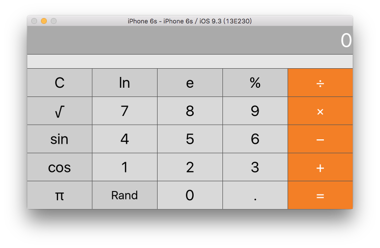
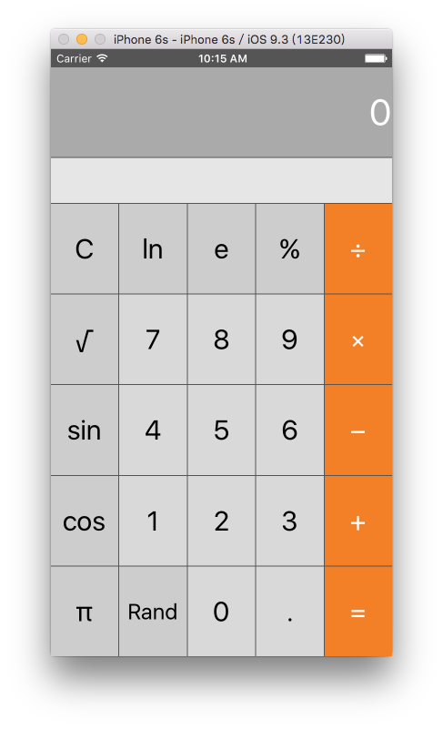

###第一次作业：

1. demo √

2. floating number input √  第一个.之后，每一个.都替换为空

3. more operations buttons √ 添加了ln，%，sin，Rand。ln/sin 带入 UnaryOperation, % 带入 BinaryOperation。Random单独写一个Random。

4. The buttons must arrange themselves nicely in portrait and landscape modes on all iPhones , Use color to make your UI look nice √  见图 

5.  description String √

6. isPartialResult Bool √ binary Operation有关，默认为false。

7. UILabel led to what is showing in the display √

8. C button to clear √