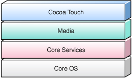

##lecture 1

* 一堆类打包叫模块。UIKit.
* 代码补全按 Tab
* nil代表一个 optional 没有被赋值 

---
iOS系统架构

1. Core OS是位于iOS系统架构最下面的一层是核心操作系统层，它包括内存管理、文件系统、电源管理以及一些其他的操作系统任务。它可以直接和硬件设备进行交互。作为app开发者不需要与这一层打交道。
2. Core Services是核心服务层，可以通过它来访问iOS的一些服务。
3. Media是媒体层，通过它我们可以在应用程序中使用各种媒体文件，进行音频与视频的录制，图形的绘制，以及制作基础的动画效果。  
4. Cocoa Touch是可触摸层，这一层为我们的应用程序开发提供了各种有用的框架，并且大部分与用户界面有关，本质上来说它负责用户在iOS设备上的触摸交互操作。

---
