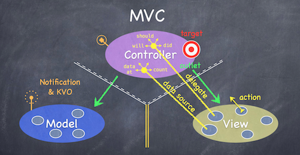
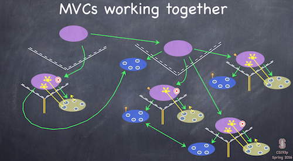

## lecture 2

#### MVC

MVC:模型(model)－视图(view)－控制器(controller)

一直在讲分层分层，分层的好处就是每一层是分开的，然后写另一层尽量就不会那么影响其他层，分层写，那么每一层都显得方便改动。

* Model  - 这个App是咋回事，就是自己心中有个数，怎样构建model，比如一个简单的contacts App，Person是一个类，存储怎么存，这就是model, more about the data and algorthim。
* Controller - How your Model is presented to the user (UI logic)， 那么Person有哪些东西，添加一个contact person要做哪些事
* View - 真正的展示在手机上我们能看到的部分

Model里引用import Foundation，永远不要import UIKit。

1. Model和View永远不能相互通信，只能通过Controller传递。
2. Controller可以直接与Model对话（读写调用Model），Model通过Notification和KVO机制与Controller间接通信。
3. Controller可以直接与View对话，通过outlet,直接操作View,outlet直接对应到View中的控件，View通过action向Controller报告事件的发生(如用户Touch我了)。Controller是View的直接数据源（数据很可能是Controller从Model中取得并经过加工了）。Controller是View的代理（delegate)，以同步View与Controller。




target - action = @IBAction .... 告知I was touched

delegate : Zoom/ Scroll (set via protocol), View 同时其自身不能拥有data，应该是controller来告知的。 

所以TableView设定其delegate 和 data source.

Controllers interpret/format Model information for the View.

Model是UI independent, Model 的 data变化，比如model是代表internet 某处的data，当其变化之时，Radio station model, broadcast 其变化. 


**一个MVC一般控制一个屏幕。**



一个MVC serve as part of view as other MVC， 同时，一个MVC是别的MVC的部分.

#### 各种 property


##### lazy property

never ever 接触computed property before。之前可能不够OOP & 也码的代码不够多。首先因为这个Swift/iOS全是class，所以其实其中的每个var都是这个类的property。

然后一看，还有lazy property,lazy propery 只有用的时候才会才会init，因为比较贵和用的几率比较小。


##### computed property

computed property并没有storage， 它的value 是 computed on the fly 当你access它的时候.

##### property observers

willSet, didSet

lazy property 和有getter 和 setter 的property不能有observer.


##### type property 

就是别的static property


参加<https://developer.apple.com/library/ios/documentation/Swift/Conceptual/Swift_Programming_Language/Properties.html>


computed property还是让我觉得非常的神奇，因为它就这么申请的把display显示的值变成了Double，并且还能成功set它。非常之神奇，神奇宝贝。特别上到π/square root那里，就神奇的展示出来了。

**Computed property 以及 property observers 真是非常重要，因为可以看到之后的Demo时常出现，而用起他们也是大有妙招.**

这里的计算应该放到model里面


#### 各种概念

##### Class

这个Class的概念和Java的很像，然后也有free initializer (constructor) , 用法在calculatorBrain那里创建一个类的instance然后调用里面的方法，那里还是很熟悉的。

然后Class完毕之后就各种概念开始齐飞了...

##### switch

我猜到了要用switch， 然后比较不同的一点是case不用break，只有default再break.

##### Dictionary

他说要用一个table，然后来查的时候我也猜到了可能要用dictionary.

##### enum

但是我没有猜到enum的出现，想一想，如果在java里面，要处理这种情况，只能用一个类来解决了，all types Captilize， all vars/local vars camelCase

optional 本质就是 generic 的 enum.


```
enum Optional<T>{
	case None
	case Some(T)
}
```


Swift 跟其他语言不同之处，也是其强大之处在于其可以有assocated values.

同时可以有多个assocated value.


然后enum可以有associated values, optional 有 assocated values，其实，所有的enum都有associated vaule.


<https://developer.apple.com/library/ios/documentation/Swift/Conceptual/Swift_Programming_Language/Enumerations.html>

##### closure

inline function，但是能捕捉其周围的变量

closure的基本写法其实就是类似于function，不过是inline，大括号包裹函数所有部分：{ 参数部分 in 函数部分 }


然后可以利用Swift的infer技术以及它默认参数，进一步简化。


* Class
* Dictionary
* Enum
* Gloabal Function
* Struct
* Closure


Struct 跟 Class 的区别是Struct 是 pass by value（跟enum一样,在stack上,copy）， class 则是pass by reference （在 heap，其实pass的是指针）.

pass by value ： array， double， int ，string 都是pass by value的，array这个有点难想到.


甚至还来了AutoLayout的constraint部分.
这就是第二课，速度简直了.


